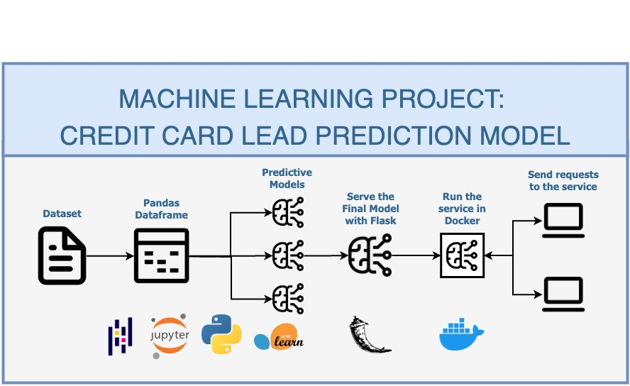

# Machine Learning Model - Credit Card Lead Prediction

By: Liz Wilson 
March 9, 2024

## *Analyzing, Modeling, and Predicting*

<!--  -->
<a href="https://www.freepik.com/free-vector/plain-credit-card-concept-illustration_5359093.htm#fromView=search&page=1&position=22&uuid=d90e714c-176e-4590-b63d-05cae216409b">Image by storyset on Freepik</a>

## Project Overview

In this project, a dataset of financial customers was utilized to fit several machine learning models which predict whether a given customer would be a good lead for a new credit card.  The training dataset includes the target variable `is_lead` which allowed for evaluation of each model.  Model parameters were tuned to choose the values that maximize the accuracy of the model.  The area under the curve (AUC) of the receiver operating characteristic curve (ROC) was the score that was utilized to choose the best model.  All of this logic is included within this [Jupyter notebook](notebook.ipynb).

Once the final model was chosen, the model was saved and made available as a web service (using Flask and GUnicorn).  Lastly, the web service was saved inside a Docker image in order to isolate it in its own environment.  This can easily be moved into a Cloud platform so that it can be available to whatever resoures may need it.

## The Dataset
The data is from [Kaggle](https://www.kaggle.com/datasets/sajidhussain3/jobathon-may-2021-credit-card-lead-prediction) and it consists of three files: a sample file, a training dataset and a test dataset.  The test dataset does not contain a value for the target variable so I decided to use the training dataset as my full dataset so that I could more easily evaluate my models.  The training dataset had 245,725 rows and 11 columns. 
**Target variable:** "is_lead", a boolean which indicated whether or not that particular customer was a lead for a credit card that they would be offering 
**Predictor variables:**
* `gender`
* `age`
* `region_code`: code corresponding to the region where the customer lives
* `occupation`
* `channel_code`: channel that the customer was acquired
* `vintage`: how long the person has been a customer
* `credit_product`: boolean indicating whether they had a credit product already
* `avg_account_balance`: average account balance in the last 12 months
* `is_active`: boolean indicating whether the customer has been active in the last 3 months

## Exploratory Data Analysis - Findings
* ID column was dropped because it was a unique identifier for a given customer and wouldn't be useful in our models
* The `credit_product` field had null values, these null values were replaced with the string `'Unknown'`
* Categorical columns: `gender`, `region_code`, `occupation`, `channel_code`, `credit_product`, and `is_active`
* Numeric columns: `age`, `vintage`, `avg_account_balance`
* The histograms for the numeric columns revealed that none of them followed a normal distribution so each was transformed to its log.  This did not help with `age` and `vintage` so those were kept as is but `avg_account_balance` was transformed to be the log value.
* `age` and `vintage` are found to be strongly correlated (0.6 Pearson correlation coefficient), both are kept in the model

## Predictive Models
Four models were fitted and evaluated:
* logistic regression
* decision tree
* random forest
* XG Boost

Parameters were tuned to find the best performance for the model. The XG Boost model had the highest AUC score and it was selected as the best model.

### AUC Score Comparison
| Model | Parameters | AUC Score |
| ----------- | ----------- | ----------- |
| Logistic Regression |  | 0.856 |
| Decision Tree | max depth: 8   min samples leaf: 100 | 0.871 |
| Random Forest | max depth: 15   min samples leaf: 5   number of estimators: 75 | 0.871 |
| XG Boost | eta: 0.1   max depth: 5   min child weight: 1 | 0.8735 |

## Serving the Model with Flask
Flask will be used to turn our model into a web service that can be accessed from outside the device where it is stored. This will allow the marketing department, an application, or another service to send a request to our model with the customer information and the web service will respond with its prediction for whether that customer would be a good credit card lead or not.  The customer data must be sent as a Python dictionary in `JSON` format and the response will be also be in `JSON` format.

### Preparations
A [python script](train.py) was created that:
* loads and transforms the dataset
* fits the final model
* saves the model (to the file `lead_scoring_model.bin`)using the Python pickle module so that it can be loaded by the Flask app

### The Flask App
The Flask app is contained within this [python script](predict.py).  
* listens on port 9696 for requests coming in to the `/predict` route with a method of `POST`
* opens and loads the pickled model file
* returns a `JSON` formatted prediction including the probability of the customer being a credit card lead as well as a boolean Yes/No

## Running within a Docker Image
### Preparations
The Python virtual environment tool Pipenv was used to package all the dependencies into two files, `Pipfile` and `Pipfile.lock`.  These two files were utilized within the Docker image in order to download all Python and library dependencies.  

### Overview
The [Dockerfile](Dockerfile) copies the Pipenv files into the `app` directory. All dependencies required for the project were installed within the Docker image. The Flask app and the model file are copied into the `app` directory.  Port 9696 was exposed so that the Docker image will listen on that port. The `ENTRYPOINT` line configures the container to listen on port 9696 for requests when the Docker image is running.  Gunicorn is a Python web server that can handle multiple requests at one time. 

### Building and Running the Image
Docker Desktop must be running first
Navigate to the project directory (where the `Dockerfile` is located) and run the following:

Building the image: `docker build -t lead-scoring .`

Running the image: `docker run -it --rm -p 9696:9696 lead-scoring`

### Testing
Now we can send in requests to our model! In a separate terminal window:
**Request**
Run the likely customer file: `python predict-test-likely.py`
**Response**
`{'is_lead': False, 'lead_probability': 0.028}
This customer is not a good lead`

**Request**
Run the unlikely customer file: `python predict-test.py`
**Response**
`{'is_lead': False, 'lead_probability': 0.028}
This customer is not a good lead`

## Next Steps
We can now easily deploy our Docker image to the cloud (AWS or GCP or another).  We would need to carefully configure the security of the cloud service so that only resources can access our service.